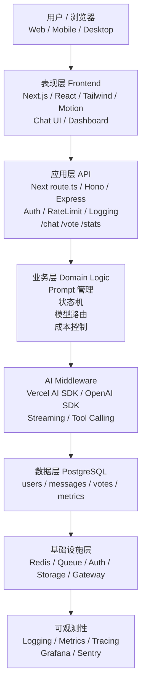

## How to start?
请先阅读项目根目录下的AGENT.md、ACCEPTANCE.md、COMMANDS.md / 严格遵守其中规则。/本任务先进入 Design Gate，只输出设计方案和测试计划，不要写代码。




## How to init your project?
```
npx create-next-app@latest space-dodge --typescript --tailwind --app
cd space-dodge
npm install three @react-three/fiber @react-three/drei zustand
npm install @types/three --save-dev
```


### bugfix
```
>bug0 gameStore.ts 中的状态字段与 Game.tsx 需要的不匹配

›bug1 游戏一片漆黑无法游玩，也没有ui界面，刷新可以出现短暂的加载游戏和丑陋的游戏ui界面，需要分析游戏架构和原  
  因，是不是状态字段不一致导致的，我是不是需要把数据库同步到neon上面

>bug2 游戏parse必须要是playing才能进入 画面一定要被绘制
```
